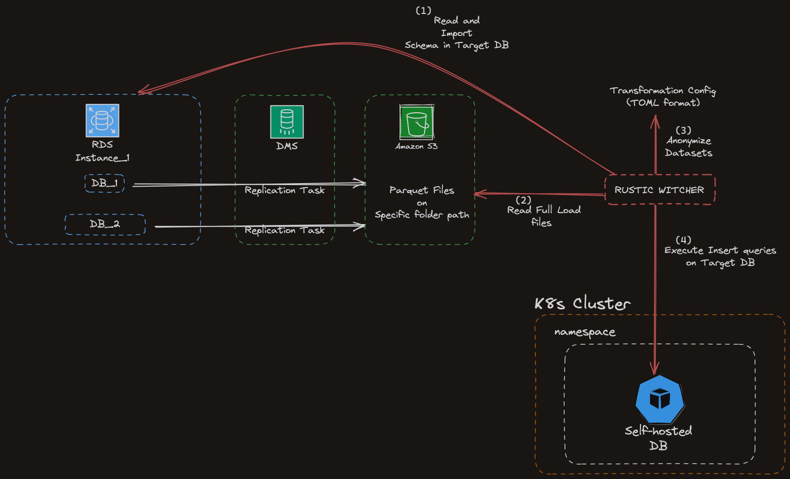
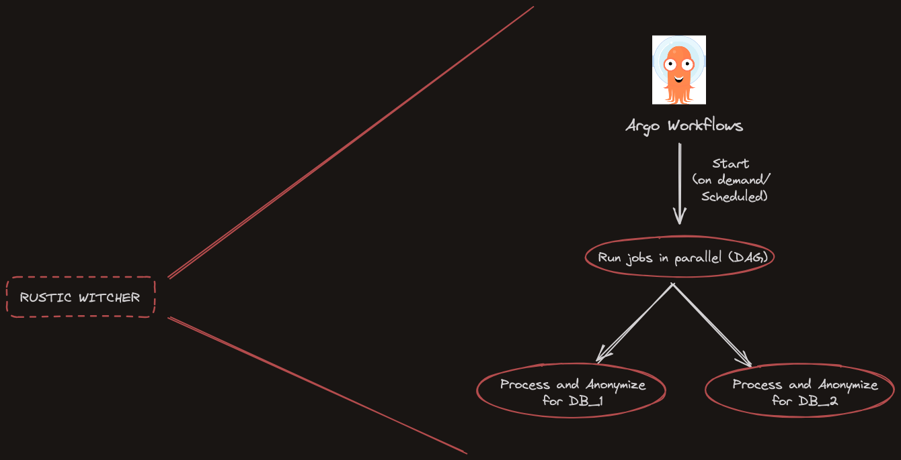
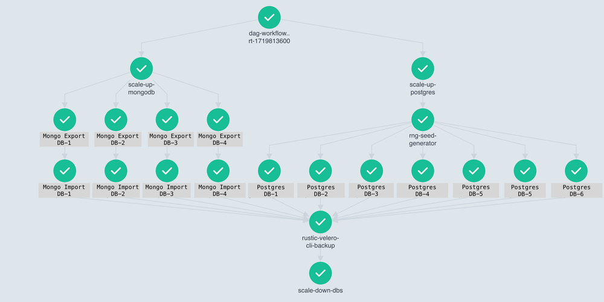

# RusticWitcher: Your ultimate toolkit for data export and anonymization

## Table of Contents
1. [Introduction](#introduction)
2. Usage
    - [Initial Configuration](docs/INITIAL_CONFIG.md)
    - [Local Execution/Debugging](docs/LOCAL_EXECUTION.md)
    - [Docker Build](docs/DOCKER_BUILD.md)
    - [Configuration Generator](docs/CONFIG_GENERATOR_CLI.md)
    - [Source Code Tests](docs/SOURCE_CODE_TESTS.md)
3. [How it works](#how-it-works)
    - [Anonymization Configuration](docs/ANONYMIZATION_CONFIG.md)
    - [Environment Variables](docs/ENVIRONMENT_VARIABLES.md)
4. [License](LICENSE)
5. [Acknowledgements](#acknowledge)

## Introduction

Welcome to **RusticWitcher**, the powerful and efficient toolkit designed specifically for all your data export and anonymization needs! Crafted with the robust and fast Rust programming language, RusticWitcher excels at handling Parquet files stored on Amazon S3, ensuring your data tasks are performed with unparalleled speed and reliability.

## Key Features

- **Blazing Fast Performance**: Leveraging the power of Rust, **RusticWitcher** offers exceptional performance, enabling you to process large datasets swiftly and efficiently.
- **Seamless Integration with Amazon S3**: Effortlessly utilize Parquet files stored on Amazon S3, with seamless integration and smooth data handling.
- **Advanced Anonymization**: Protect sensitive information with sophisticated anonymization techniques, ensuring compliance with data privacy standards.
- **Easy Data Export**: Simplify your data export tasks with intuitive and flexible options, tailored to meet various data processing requirements.

## Why choose Rustic Witcher?

**Rustic Witcher** stands out with its blend of speed, security, and simplicity. Whether you're a data engineer, data scientist, or developer, our toolkit is designed to cater to your needs, offering robust solutions for exporting and anonymizing data efficiently.

Embrace the future of data handling with **Rustic Witcher**. Get started today and experience the power of Rust in your data workflows!

> [!NOTE]
> Average percentage of time saved by Rustic Witcher compared to the previous solution: **69.09%** and a median percentage of time saved: **74.42%**.

# How it works

> [!NOTE]
> The suggested way of use is shown below :point_down:

An overall architecture of rustic-witcher is shown below:

A more zoomed in orchestration with Argo Workflows is depicted below:

Through the Argo Workflows UI, the final DAG of the whole process of all rustic-witcher apps per database/schema combination as well as of all mongo-buddy apps per cluster/database combination is:

## Acknowledge
Blueground's Platform team
