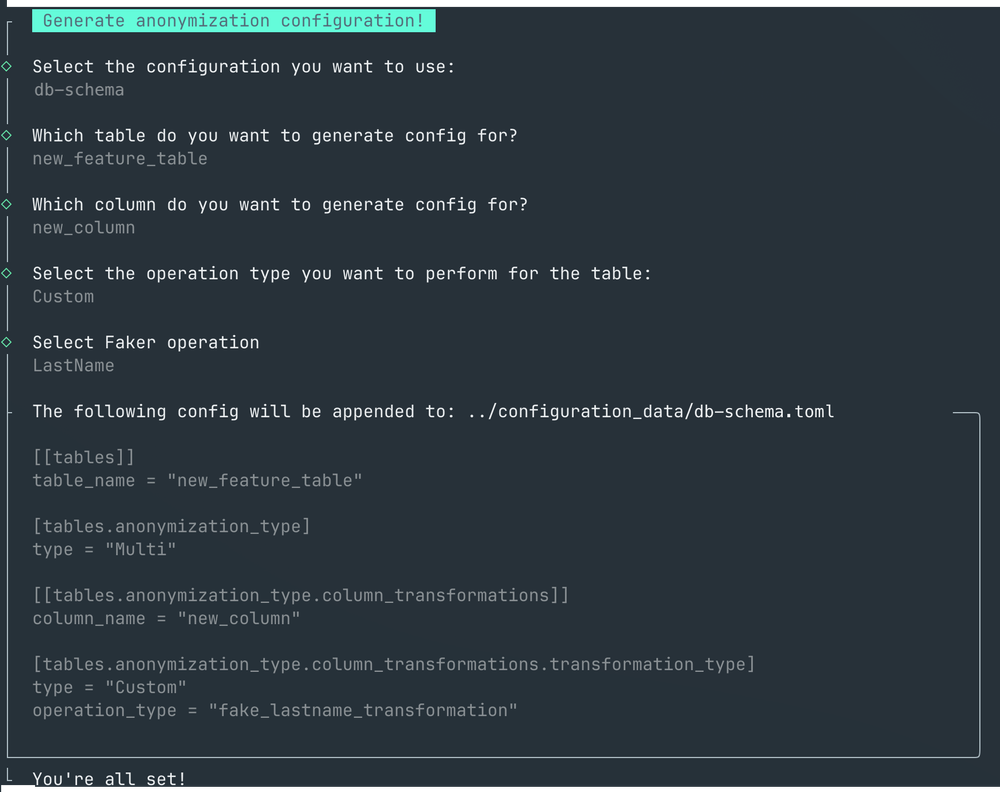

# Configuration Generator

Rustic Witcher also includes a CLI that allows you to generate a configuration.

It is important to note that the binary must be executed under `rustic-config-generator-cli` folder in `rustic-witcher` because it needs to read the configuration data properly.

1. Clone the project
2. Open a new branch
3. Run the CLI tool:
```shell
cd ./rustic-witcher/rustic-config-generator-cli
./rustic-config-generator-cli
```
4. Commit the changes & open a PR
5. Done :tada:


